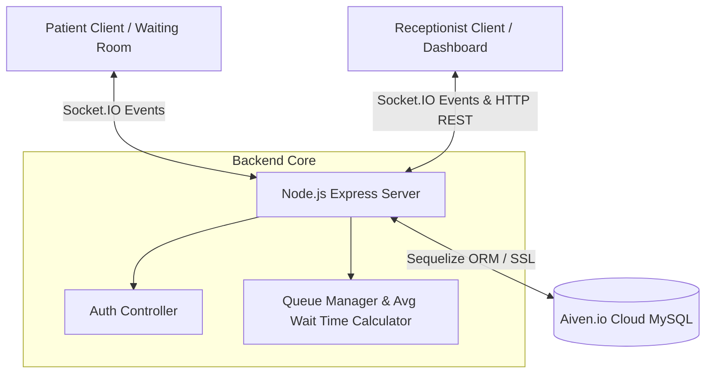

# Queue Cure – Smart Clinic Token Management System

Queue Cure is a real-time digital queue management application designed for modern clinics and hospitals. The platform consists of a **Receptionist Dashboard** for administrative actions (adding patients, calling tokens, resetting queues) and a live **Patient Waiting Room Display** with real-time audio announcements, personalized patient progress statistics, and dynamic waiting time predictions.

---

## 🏗️ Architecture & Real-Time Flow



---

## ✨ Features

### 1. Receptionist Dashboard
* **Token Management**: Add patients to the queue with Name and Phone, Call Next, Mark Completed, or Skip.
* **Smart Voice Announcements**: High-fidelity SpeechSynthesis audio announcements (e.g., *"Token number 5, please proceed to the doctor's consultation room"*).
* **Audio Controls**: Dedicated mute/unmute toggles and volume sliders.
* **Real-time Synchronization**: Live updates pushed to all screens instantly using Socket.IO.
* **Clinic Reset**: Perform a soft daily reset to clean the database logs and reset the default wait timer.

### 2. Waiting Room Screen
* **Live "Now Serving" Board**: Highly visible, modern glassmorphic display cards calling out the active patient.
* **Speech Auto-Play Unlock**: A smart interactive overlay that prompts visitors to tap/click once to unlock browser-restricted SpeechSynthesis audio.
* **Unified Visual Grid**: A list showing all waiting tokens and statuses.

### 3. Patient Portal & Token Tracker
* **Personalized Greeting Banner**: Once logged in, patients see their details: *"Hello, Aman | Your Token: #5"*.
* **Status Updates**: Alerts patients if it is their turn: *"🎉 It's Your Turn! Please proceed to the doctor's consultation room now."*
* **Estimated Wait-Time Breakouts**: Displays the exact number of patients ahead and a customized wait time:
  $$\text{Individual Wait Time} = \text{Queue Position} \times \text{Average Consultation Duration}$$

### 4. Dynamic Wait Time Calculator
* **Interval-based Averaging**:
  * The first 2 patients default to a 10-minute consultation time.
  * When exactly **3** patients are completed, the system calculates the average of these 3 consultations and updates the clinic settings.
  * This value is held stable until **6** patients are completed, at which point it recalculates the average of all 6, and so on (updating at 9, 12, etc.).
* **Auto-Revert**: Resetting the queue automatically restores the baseline wait time to **10 minutes**.

---

## 🛠️ Tech Stack

* **Frontend**: React (Vite), Tailwind CSS, Framer Motion (micro-animations), Lucide React, Socket.IO Client.
* **Backend**: Node.js, Express, Socket.IO, Sequelize (ORM).
* **Database**: MySQL (Aiven.io cloud-hosted, SSL supported).
* **Deployment**: Render.com.

---

## 📂 Project Structure

```text
queue_management/
├── backend/
│   ├── config/
│   │   └── db.js            # Sequelize connection with SSL settings
│   ├── controllers/
│   │   ├── authController.js
│   │   └── queueController.js
│   ├── models/
│   │   ├── Patient.js       # Patient schema (token, position, duration metrics)
│   │   └── Settings.js      # Global clinic parameters (current average wait time)
│   ├── routes/
│   │   ├── authRoutes.js
│   │   ├── patientRoutes.js
│   │   └── queueRoutes.js
│   ├── server.js            # Express server & Socket.IO mounting point
│   └── package.json
├── frontend/
│   ├── src/
│   │   ├── components/
│   │   │   └── TokenDisplay.jsx   # Interactive live scoreboard
│   │   ├── pages/
│   │   │   ├── Login.jsx          # Dual-tab login (Patient / Receptionist)
│   │   │   ├── ReceptionistDashboard.jsx
│   │   │   └── WaitingRoom.jsx
│   │   ├── services/
│   │   │   └── api.js             # Unified Axios instance
│   │   ├── socket/
│   │   │   └── socket.js          # WebSockets connection utility
│   │   └── main.jsx
│   ├── tailwind.config.js
│   └── package.json
└── README.md
```

---

## 🚀 Installation & Local Setup

### Prerequisite
Ensure you have **Node.js (v18+)** and **MySQL** installed.

### 1. Backend Setup
1. Navigate to the backend directory:
   ```bash
   cd backend
   ```
2. Install dependencies:
   ```bash
   npm install
   ```
3. Create a `.env` file in the `backend/` directory:
   ```env
   PORT=5000
   DB_HOST=127.0.0.1
   DB_USER=root
   DB_PASSWORD=your_local_password
   DB_NAME=queue_db
   DB_PORT=3306
   ```
4. Run in development mode:
   ```bash
   npm run dev
   ```

### 2. Frontend Setup
1. Navigate to the frontend directory:
   ```bash
   cd ../frontend
   ```
2. Install dependencies:
   ```bash
   npm install
   ```
3. Create a `.env` file in the `frontend/` directory (optional for local customization, falls back to localhost if not specified):
   ```env
   VITE_API_URL=http://localhost:5000
   ```
4. Start the development server:
   ```bash
   npm run dev
   ```

---

## ☁️ Deployment Instructions (Render.com)

### 1. Cloud Database (Aiven.io MySQL)
* Create a MySQL database instance.
* Copy the connection URI or parameters (Host, User, Password, Port, Database name).

### 2. Backend Deployment on Render
* Create a **Web Service** pointing to your repository.
* Set the **Root Directory** to `backend`.
* **Build Command**: `npm install`
* **Start Command**: `node server.js` or `npm start`
* Add the following **Environment Variables**:
  * `DB_HOST`: *Your cloud DB host*
  * `DB_USER`: *Your cloud DB user*
  * `DB_PASSWORD`: *Your cloud DB password*
  * `DB_NAME`: *Your cloud DB name*
  * `DB_PORT`: *Your cloud DB port (e.g. 12345)*
  * `DB_SSL`: `true`

### 3. Frontend Deployment on Render
* Create a **Static Site** pointing to your repository.
* Set the **Root Directory** to `frontend`.
* **Build Command**: `npm run build`
* **Publish Directory**: `dist`
* Add the following **Environment Variables**:
  * `VITE_API_URL`: *Your backend Render Web Service URL (e.g., `https://queue-management-backend2.onrender.com`)*

---

## 🔧 Core Fixes Implemented

### 🛡️ CORS origin Wildcard Fix
Browsers block cookie/header transfers if `credentials: true` is enabled on the server alongside a wildcard origin (`*`). This was solved by setting the CORS configuration dynamically:
```javascript
// backend/server.js
const corsOptions = {
  origin: true, // Echoes the requesting client's origin back automatically
  credentials: true,
};
app.use(cors(corsOptions));
```

### 🔑 Aiven SSL Verification Handshake Fix
Aiven.io MySQL databases utilize secure SSL connections. Node.js Sequelize configurations fail unless the SSL certificate hierarchy is accepted. This was resolved by forcing connection configs to bypass peer authorization verification:
```javascript
// backend/config/db.js
dialectOptions: {
  ssl: {
    require: true,
    rejectUnauthorized: false // Bypasses self-signed handshake verification warnings
  }
}
```
